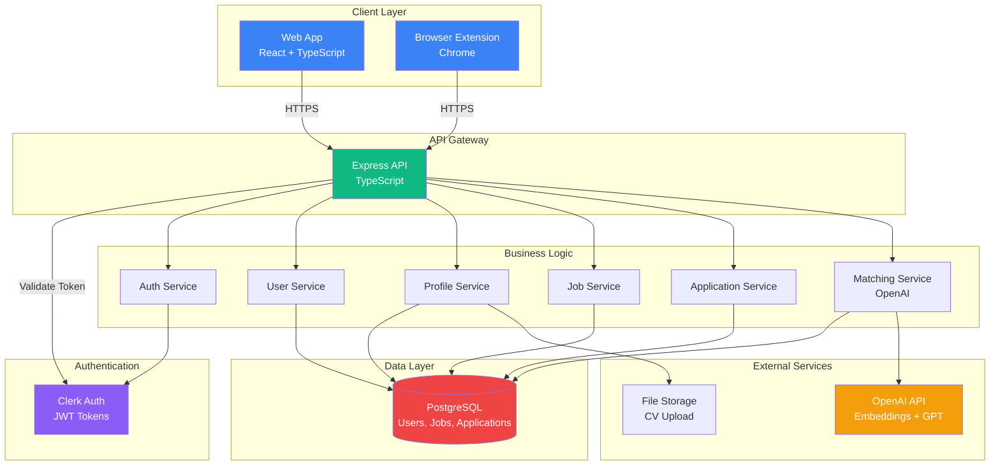
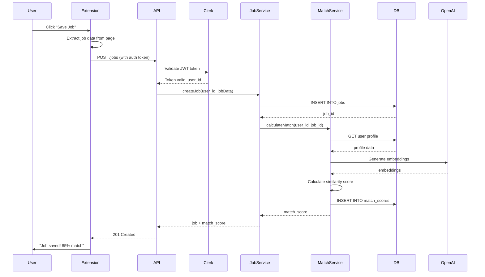
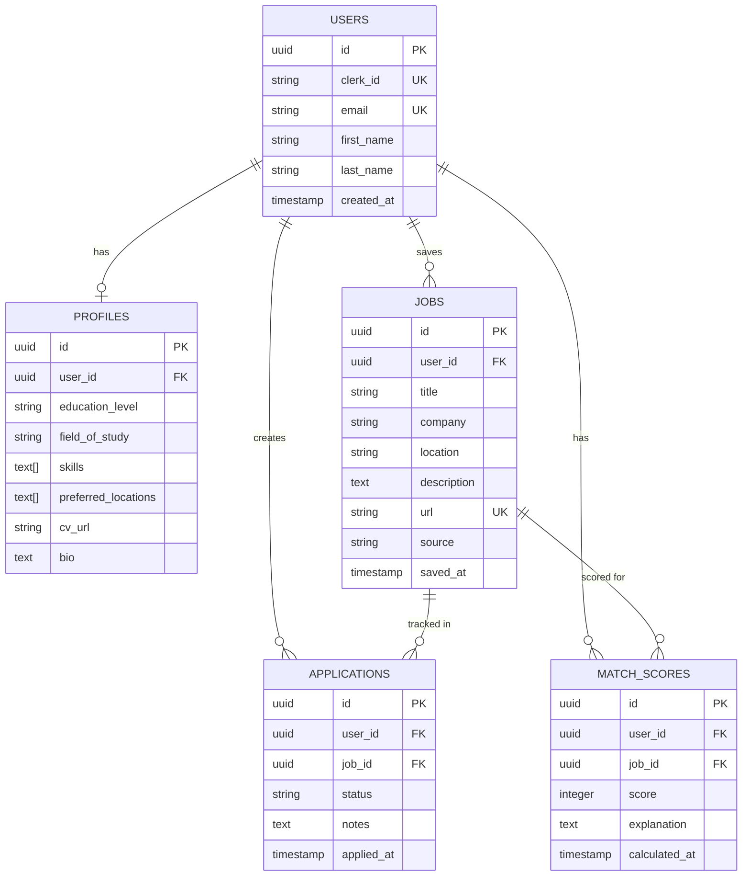
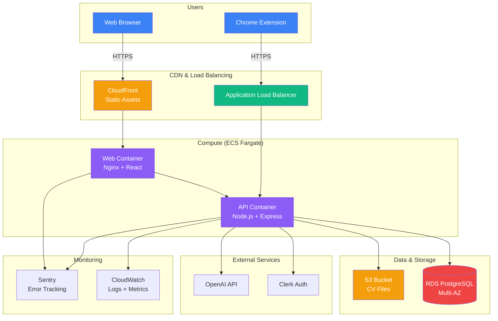
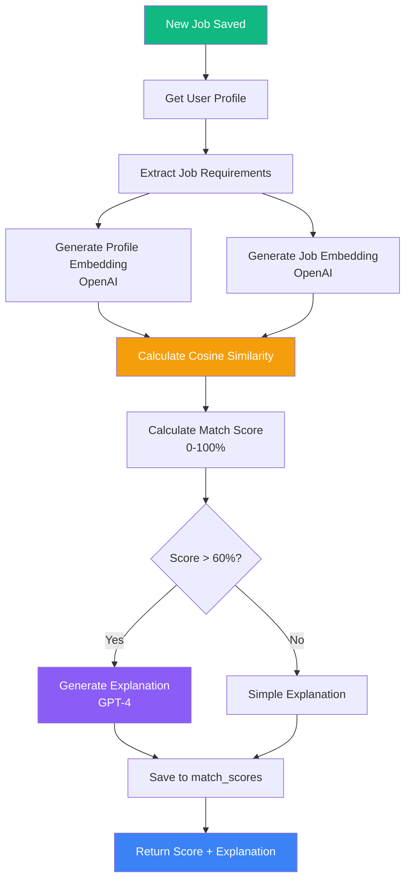

# AlternaGen V1 - Architecture Diagram

## System Architecture Overview



## Data Flow: Save Job from Extension



## Database Schema (Entity Relationship)



## Component Architecture (Frontend)

```
web/kassy-kube/
├── src/
│   ├── components/
│   │   ├── auth/
│   │   │   ├── LoginForm.tsx
│   │   │   └── SignupForm.tsx
│   │   ├── dashboard/
│   │   │   ├── JobCard.tsx
│   │   │   ├── JobList.tsx
│   │   │   └── FilterBar.tsx
│   │   ├── profile/
│   │   │   ├── ProfileForm.tsx
│   │   │   └── CVUpload.tsx
│   │   ├── jobs/
│   │   │   ├── JobDetail.tsx
│   │   │   └── MatchScore.tsx
│   │   └── applications/
│   │       ├── KanbanBoard.tsx
│   │       └── ApplicationCard.tsx
│   ├── pages/
│   │   ├── Landing.tsx
│   │   ├── Dashboard.tsx
│   │   ├── Profile.tsx
│   │   ├── JobDetail.tsx
│   │   └── Applications.tsx
│   ├── services/
│   │   ├── api.ts          # Axios instance
│   │   ├── auth.ts         # Clerk integration
│   │   ├── jobs.ts         # Job API calls
│   │   └── profiles.ts     # Profile API calls
│   ├── hooks/
│   │   ├── useAuth.ts
│   │   ├── useJobs.ts
│   │   └── useProfile.ts
│   ├── types/
│   │   ├── user.ts
│   │   ├── job.ts
│   │   └── application.ts
│   └── utils/
│       ├── formatters.ts
│       └── validators.ts
```

## Component Architecture (Backend)

```
api/
├── src/
│   ├── routes/
│   │   ├── auth.routes.ts
│   │   ├── users.routes.ts
│   │   ├── profiles.routes.ts
│   │   ├── jobs.routes.ts
│   │   ├── applications.routes.ts
│   │   └── match.routes.ts
│   ├── controllers/
│   │   ├── auth.controller.ts
│   │   ├── users.controller.ts
│   │   ├── profiles.controller.ts
│   │   ├── jobs.controller.ts
│   │   ├── applications.controller.ts
│   │   └── match.controller.ts
│   ├── services/
│   │   ├── auth.service.ts
│   │   ├── user.service.ts
│   │   ├── profile.service.ts
│   │   ├── job.service.ts
│   │   ├── application.service.ts
│   │   └── matching.service.ts
│   ├── models/
│   │   ├── user.model.ts
│   │   ├── profile.model.ts
│   │   ├── job.model.ts
│   │   ├── application.model.ts
│   │   └── matchScore.model.ts
│   ├── middleware/
│   │   ├── auth.middleware.ts
│   │   ├── validation.middleware.ts
│   │   └── error.middleware.ts
│   ├── utils/
│   │   ├── database.ts
│   │   ├── logger.ts
│   │   └── validators.ts
│   ├── types/
│   │   └── index.ts
│   └── index.ts
```

## Deployment Architecture (AWS)



## Security Architecture

```mermaid
graph LR
    subgraph "Client"
        USER[User]
    end

    subgraph "Auth Flow"
        LOGIN[Clerk Login]
        JWT[JWT Token]
    end

    subgraph "API Security"
        CORS[CORS Middleware]
        AUTH_MW[Auth Middleware]
        RATE[Rate Limiting]
        VALID[Input Validation]
    end

    subgraph "Data Security"
        ENCRYPT[Encryption at Rest]
        SSL[SSL/TLS in Transit]
        BACKUP[Automated Backups]
    end

    USER --> LOGIN
    LOGIN --> JWT
    JWT --> CORS
    CORS --> AUTH_MW
    AUTH_MW --> RATE
    RATE --> VALID
    VALID --> ENCRYPT
    ENCRYPT --> SSL
    SSL --> BACKUP

    style USER fill:#3b82f6,color:#fff
    style JWT fill:#10b981,color:#fff
    style AUTH_MW fill:#ef4444,color:#fff
    style ENCRYPT fill:#8b5cf6,color:#fff
```



## Matching Algorithm Flow



---

## Technology Stack Summary

| Layer | Technology | Justification |
|-------|------------|---------------|
| **Frontend** | React 19 + TypeScript | Type safety, modern hooks, fast |
| **Build Tool** | Vite | Lightning-fast HMR, modern |
| **Styling** | Tailwind CSS | Utility-first, rapid prototyping |
| **State** | React Query + Context | Server state + local state |
| **Backend** | Express + TypeScript | Mature, flexible, TypeScript support |
| **Database** | PostgreSQL 15 | Relational data, ACID, JSON support |
| **ORM** | Prisma | Type-safe, migrations, great DX |
| **Auth** | Clerk | Production-ready, webhooks, UI |
| **AI** | OpenAI API | Embeddings + GPT-4 for matching |
| **File Storage** | AWS S3 | Scalable, cheap, reliable |
| **Deployment** | Docker + ECS Fargate | Containerized, serverless compute |
| **CI/CD** | GitHub Actions | Free, integrated, flexible |
| **Monitoring** | CloudWatch + Sentry | Logs + error tracking |
| **Testing** | Vitest + Supertest | Fast, modern, TypeScript |

---

## API Rate Limits & Quotas

| Service | Limit | Cost Impact |
|---------|-------|-------------|
| **Clerk** | 10,000 MAU free | $0 until 10k users |
| **OpenAI** | Pay-per-use | ~$0.10 per match (embeddings + GPT) |
| **AWS RDS** | db.t3.micro | ~$15/month |
| **AWS ECS** | 2 tasks (256 CPU) | ~$30/month |
| **AWS S3** | 5GB storage | ~$0.12/month |

**Total Estimated Cost (500 users)**: ~$50-100/month

---

## Scalability Considerations

### Current Capacity (V1)
- **Users**: 10,000 MAU (Clerk free tier)
- **Requests**: ~100 req/s (single ECS task)
- **Database**: 20GB storage (RDS)
- **Files**: 5GB (S3)

### Scaling Strategy (V2+)
1. **Horizontal Scaling**: Add more ECS tasks (auto-scaling)
2. **Database**: Read replicas for analytics queries
3. **Caching**: Redis for frequently accessed data
4. **CDN**: CloudFront for static assets
5. **Queue**: SQS for async job processing (matching)

---

**Document Status**: ✅ Complete - Ready for Review

**Next**: Await founder validation before Phase 2 (Execution)
